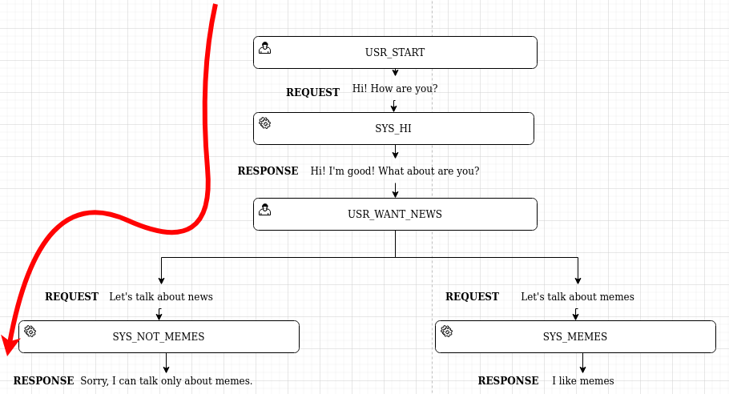

# DialogFlow Framework
## Introduction 
It is a framework that makes it easy to create dialog graphs. This will help you quickly make a dialogue assistant with a given graph of dialogues. 

## How to quickly build a dialog graph 
Suppose we want to build on the following dialogue:
```
user/human: Hi! How are you? 
bot: Hi! I'm good! What about are you?
user/human: Let's talk about news
bot: Sorry, I can talk only about memes.
```
We can use two types of graph nodes:
- `user node` represents state of user
- `system node` represents state of bot

For this nodes we can add transitions:
- `request transition` makes transition from `user node` -> (to) `system node`. `reuqest transition` is available when a condiiton of transition is `true`
- `response transition` makes transition from `system node` -> (to) `user node`. `response transition` is always available, but it can be single from one node.



You can find code of this example here `dff_template/dialogflows/flows/memes.py`  also available other scenarios, you can find them in `dff_template/dialogflows/flows/*`.

Dialogue with notes:
```bash
user/human: Hi! How are you?  # USR_START
bot: Hi! I am good! What about are you?  # SYS_HI
user/human: Lets talk about news  # USR_WANT_NEWS
bot: Sorry, I can talk only about memes.  # SYS_NON_MEMES
```

## Structure of project
`dff_template` consists custom code for some dialogue assistant. `common/dialogflow_framework` consists custom code for share between all dialogue assistants.


## Getting started

```
docker-compose up -d
docker-compose exec dff-template python run.py
```

## Coding Challenge
You need to make a dilalog bot that asks 5 questions about [Zen of Python](https://en.wikipedia.org/wiki/Zen_of_Python) and checks the correctness of the answers and gives comments on each.